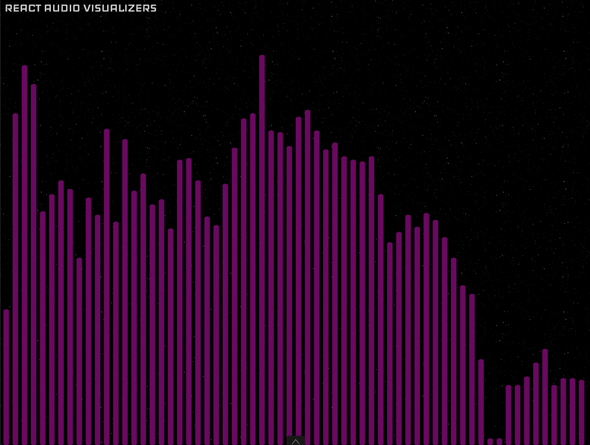
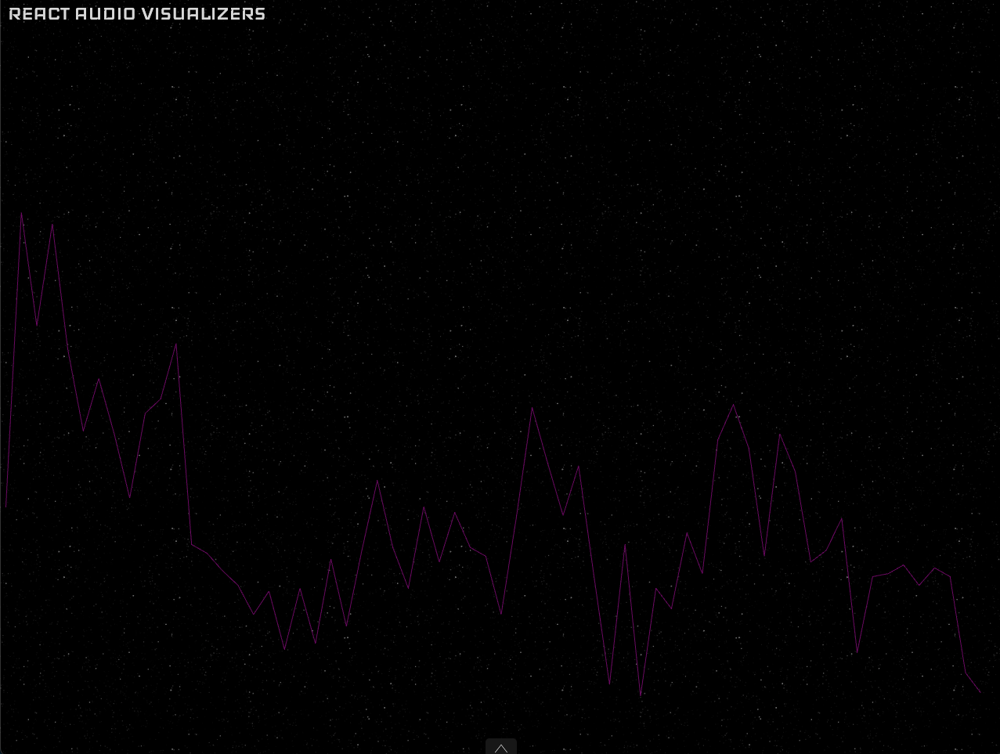
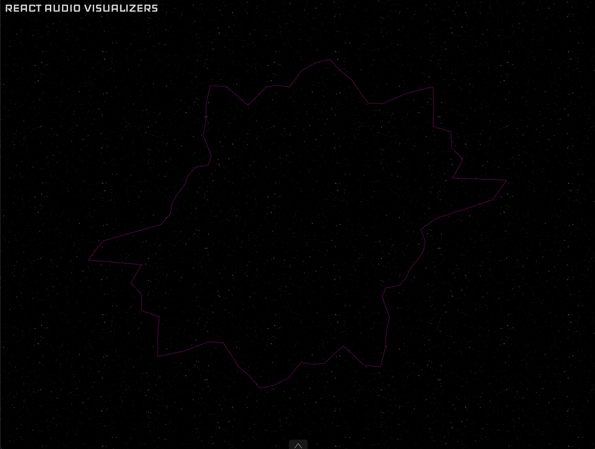
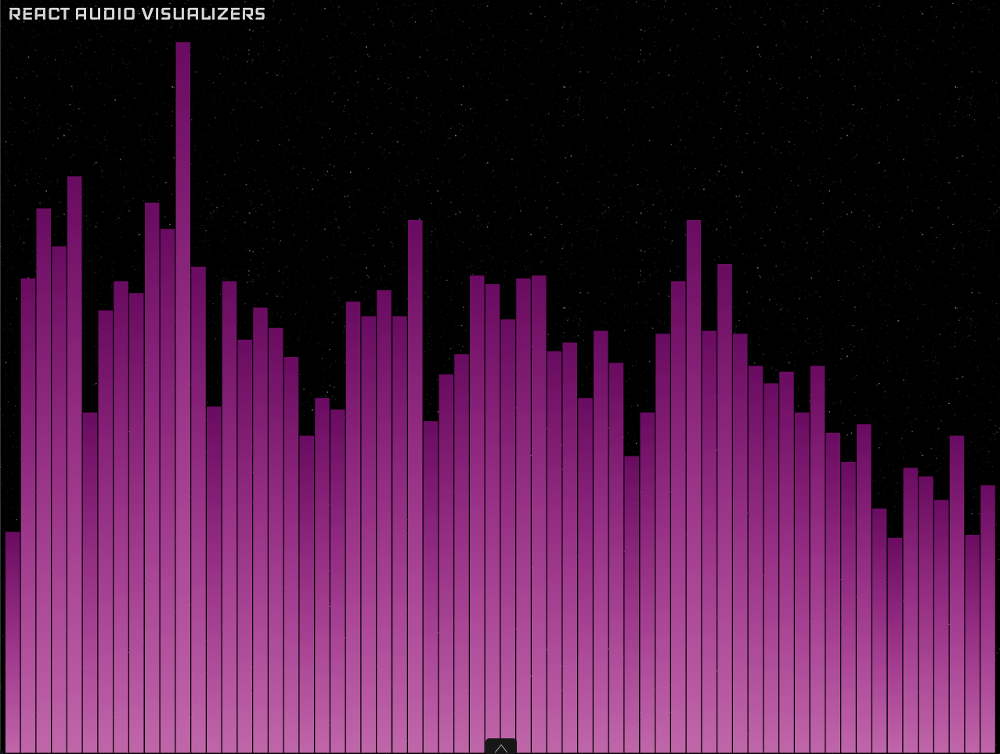

# `<SpectrumVisualizer>`

The `<SpectrumVisualizer>` is an audio visualizer that shows the amplitude of the audio per frequency. The visualizer has the frequency on the horizontal axis and the amplitude on the vertical axis.



## Usage

```jsx
import { SpectrumVisualizer, SpectrumVisualizerTheme } from 'react-audio-visualizers';

export const YourApp = () => (
  <SpectrumVisualizer
    audio="yourAudioFile"
    theme={SpectrumVisualizerTheme.roundBars}
  />
);
```

## Props

`<SpectrumVisualizer>` accepts all [`AudioVisualizerCommonProps`](./Types.html#audiovisualizercommonprops) described in [`<AudioVisualizer>`](./AudioVisualizer.html).

It also accepts some specific props listed bellow:

- [`theme`](#theme)
- [`colors`](#colors)
- [`lowFrequency`](#lowfrequency)
- [`highFrequency`](#highfrequency)
- [`numBars`](#numbars)
- [`radius`](#radius)
- [`barWidth`](#barWidth)
- [`startingAngle`](#startingangle)
- [`mirror`](#mirror)


### `theme`

The `theme` prop changes the aspect of the visualizer and is required.

It can be one of the following:

- [`line`](#line)
- [`radialLine`](#radialline)
- [`radialSquaredBars`](#radialsquaredbars)
- [`roundBars`](#roundbars)
- [`squaredBars`](#squaredbars)

#### line



#### radialLine



#### radialSquaredBars


#### roundBars


#### squaredBars



### `colors`

An array with elements of type [Color](./Types.html#color). Defaults to white when no value is provided.

### `lowFrequency`

The lower value for the frequency in Hz to filter the audio. For example, if a value of 200 is passed no frequency bellow 200Hz will be shown. In other words is the frequency that the spectrum will start from. Defaults to 20 if no value is provided.

### `highFrequency`

The higher value for the frequency in Hz to filter the audio. For example, if a value of 5000 is passed no frequency above 5000Hz will be shown. In other words is the frequency that the spectrum will end in. Defaults to 20000 if no value is provided.

### `numBars`

The number of bars to draw, only available for themes with bars: [`radialSquaredBars`](#radialsquaredbars), [`roundBars`](#roundbars) and [`squaredBars`](#squaredbars). The default value depends on the theme and is adaptive to the screen size.

### `radius`

The radius of the circle, only available for radial themes: [`radialLine`](#radialline) and [`radialSquaredBars`](#radialsquaredbars). By default the value is adapted to the screen size.

### `barWidth`

The width of the bars, only available for themes with bars: [`radialSquaredBars`](#radialsquaredbars), [`roundBars`](#roundbars) and [`squaredBars`](#squaredbars). By default it adapts this value to the screen size and the number of bars.

### `startingAngle`

The angle, in radians, on the circle to start drawing from, only available for radial themes: [`radialLine`](#radialline) and [`radialSquaredBars`](#radialsquaredbars). Defaults to PI.

### `mirror`

A `boolean` value that if is set to true mirrors the spectrum in two sides of the circle, only available for radial themes: [`radialLine`](#radialline) and [`radialSquaredBars`](#radialsquaredbars). Instead of using the whole circle for the spectrum it divides the circle in two and shows the full frequency range for each part. Defaults to false.
