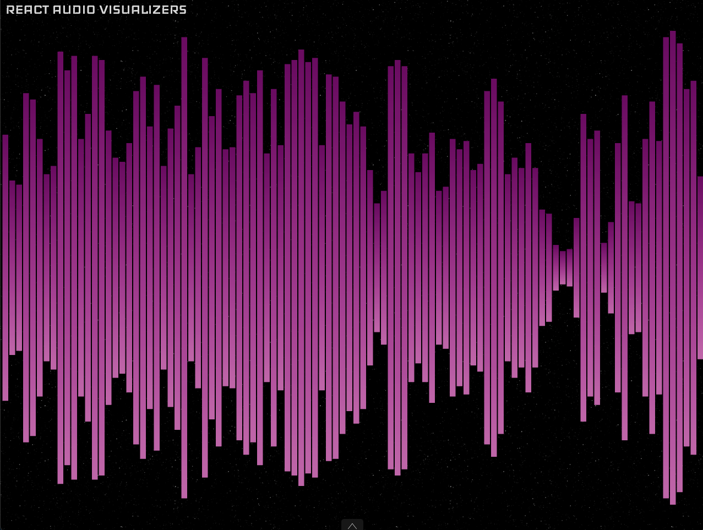
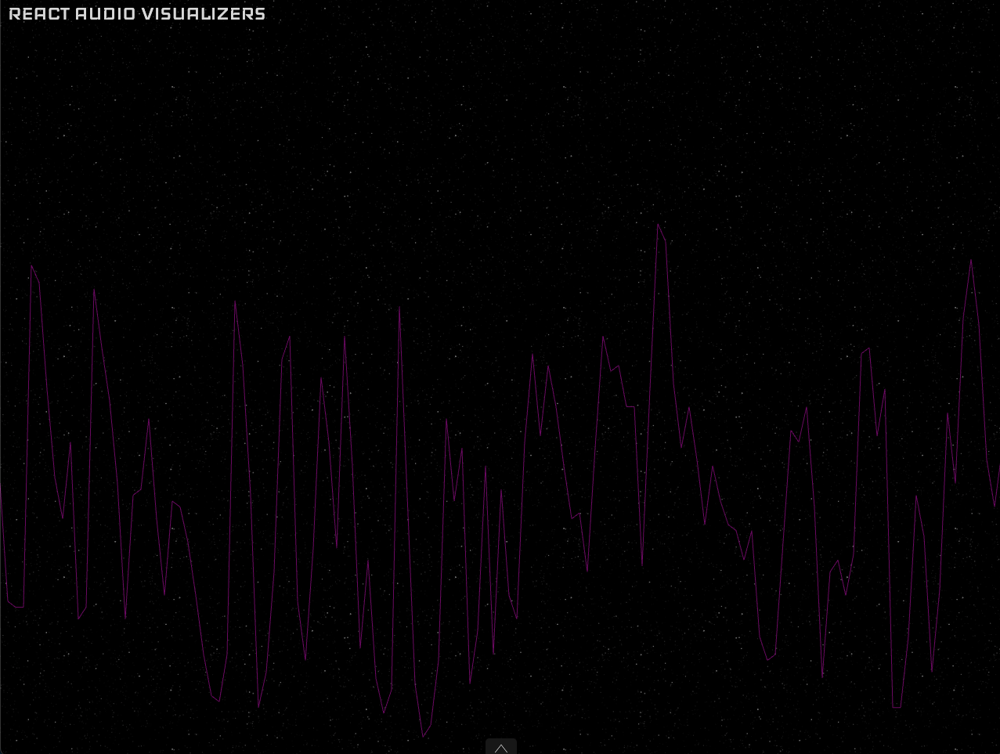

# `<WaveformVisualizer>`

The `<WaveformVisualizer>` component is an audio visualizer that streams the overall amplitude of the audio over time.



## Usage

```jsx
import { WaveformVisualizer, WaveformVisualizerTheme } from 'react-audio-visualizers';

export const YourApp = () => (
  <WaveformVisualizer
    audio="yourAudioFile"
    theme={WaveformVisualizerTheme.squaredBars}
  />
);
```

## Props

`<WaveformVisualizer>` accepts all [`AudioVisualizerCommonProps`](./Types.html#audiovisualizercommonprops) described in [`<AudioVisualizer>`](./AudioVisualizer.html).

It also accepts some specific props listed bellow:

- [`theme`](#theme)
- [`colors`](#colors)
- [`barMargin`](#barmargin)
- [`barWidth`](#barwidth)
- [`refreshRate`](#refreshrate)

### `theme`

The `theme` prop changes the aspect of the visualizer and is required.

It can be one of the following:

- [`line`](#line)
- [`squaredBars`](#squaredbars)

#### line



#### squaredBars


### `colors`

An array with elements of type [Color](./Types.html#color). For the [`squaredBars`](#squaredbars) theme every color of the array is used to create a gradient, while for the [`line`](#line) theme only the first color is used. Defaults to white when no value is provided.

### `barMargin`

The margin between bars, only available when the theme is [`squaredBars`](#squaredbars). Defaults to 2.5 when no value is provided.

### `barWidth`

The width of the bars in [`squaredBars`](#squaredbars) theme. Defaults to 10 when no value is provided.

### `refreshRate`

The time, in seconds, to rerender the visualizer. Defaults  to 0.025 when no value is provided.